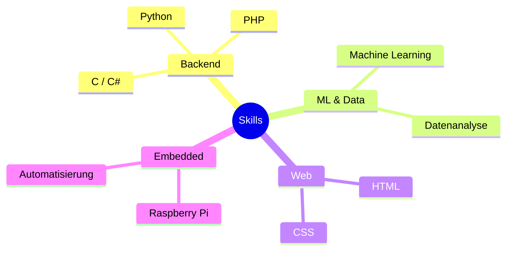

# 👋 Hallo, ich bin @NataPavelko

💻 Ich studiere derzeit zur **Fachinformatikerin (Anwendungsentwicklung)** und arbeite aktiv an Projekten, um meine Fähigkeiten auszubauen.

---

## 🗂️ Meine Skills 

---

## 📫 Wie du mich erreichen kannst

- 🔗 **GitHub:** [@NataPavelko](https://github.com/NataPavelko)
- 📧 **E-Mail:** [natapavelko@gmail.com](mailto:natapavelko@gmail.com)
- 💼 **LinkedIn:** [Nataliia Pavelko](https://www.linkedin.com/in/nataliia-pavelko/)
---
## 👀 Interessen
- 🧠 Backend-Entwicklung: **Python**, **PHP**, **C**, **C#**
- 📊 **Maschinelles Lernen & Datenanalyse**
- 🌐 Webentwicklung: **HTML**, **CSS**
- 🤖 **Eingebettete Systeme & Raspberry Pi**
- 📚 **Projektbasiertes Lernen**

---

## 🌱 Derzeit lerne ich
- 🐍 Fortgeschrittenes **Python** & **Machine Learning**
- 🍓 **Raspberry Pi Automatisierung** (Projekt *AspirePi*)
- 🎨 Best Practices in der **Webentwicklung**

---

## 💼 Praktikum gesucht!
Ich bin auf der Suche nach einem Praktikum im Bereich:
- **Backend-Entwicklung**
- **Datenanalyse**
- **Webentwicklung**

---

## 🏡 Über mich
- 🍳 Ich liebe **Kochen & Häkeln** 🧶
- 🏠 Leidenschaft für **Innenarchitektur & gemütliches Zuhause**
- 🌍 Kulturelle Vielfalt begeistert mich
- 🐱 **Katzenliebhaberin** (Plane Spaziergänge mit meiner Katze!)

---

